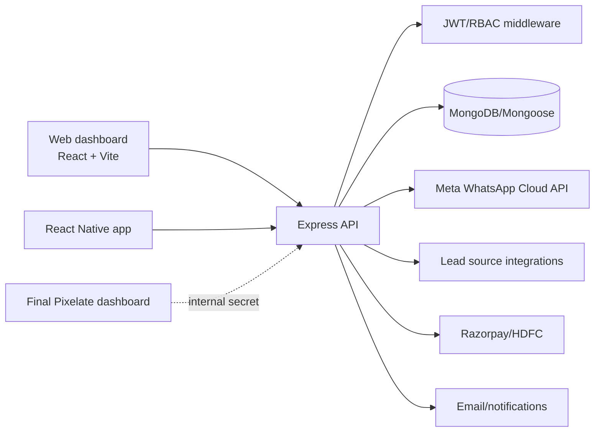
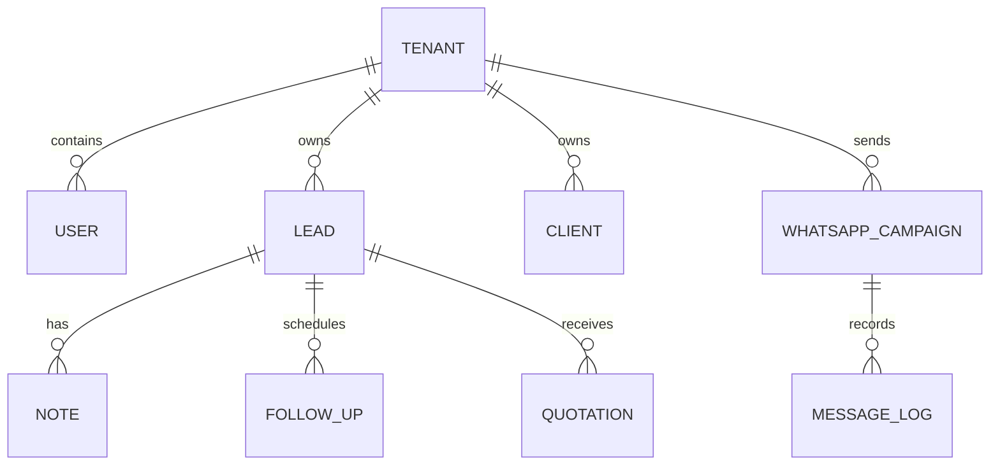

# NestLeads Architecture

**Last reviewed:** 2026-09-20

## System Design

## Components

- `backend/server.js`: Express startup, middleware, routes, static uploads, rate limits, and port configuration.
- `backend/routes/`: HTTP route registration by domain.
- `backend/controllers/`: request orchestration and response formatting.
- `backend/models/`: Mongoose tenant and domain entities.
- `backend/services/`: WhatsApp, notifications, integrations, billing, and other external behavior.
- `backend/jobs/`: scheduled work such as reminders or sync tasks.
- `frontend/src/`: Vite React dashboard, pages, contexts, API client, and reusable UI.
- `NestLeads/src/`: React Native navigation, screens, storage, and API client.
- `ai-agent/`: automation/agent work; treat as a separate integration boundary.

## Request Flow

1. A web/mobile client sends an API request with its auth token.
2. Express applies security middleware, rate limits, and route middleware.
3. Auth middleware resolves the user and tenant; controllers enforce resource permissions.
4. Controllers validate input, query/update Mongoose models, and call external services when required.
5. The API returns a consistent success/error payload; clients update local state and show loading/error/empty states.

## Data Boundaries

- **Tenant boundary:** every tenant-owned model must carry a company/tenant reference and every query must include the authenticated tenant.
- **Identity boundary:** users, roles, JWTs, 2FA, and reset/OTP flows are owned by auth controllers/middleware.
- **Communication boundary:** WhatsApp webhook and outbound sends are isolated behind WhatsApp services.
- **Payment boundary:** gateway callbacks are untrusted until verified by the backend.
- **File boundary:** uploads are served through controlled paths; document path resolution must prevent traversal.

## Primary Domain Relationships

## Configuration

- Backend configuration is loaded from `backend/.env`; document variable names only.
- Frontend uses `VITE_API_URL`.
- Mobile currently contains an Android emulator API base in the React Native service; make this environment-aware before release builds.
- Required external systems include MongoDB, Meta/WhatsApp where enabled, payment gateway credentials, email delivery, and optional AI providers.

## Reliability and Security Notes

- Existing audit material identifies token storage, CSRF, rate limiting, input sanitization, payment verification, API-key display, and backend RBAC as priority risks.
- Webhooks must be authenticated/verified and idempotent.
- Scheduled jobs must be tenant-aware and safe to retry.
- Do not expose secrets through logs, frontend code, screenshots, or documentation.

## Extension Points

- Add a domain by creating a model, controller/service, route registration, client API wrapper, and web/mobile screen where relevant.
- Add an integration behind a service interface and a webhook/credential health check.
- Add a report by defining its filters, tenant-scoped query, export shape, and permission requirement.
- Add a role capability in backend authorization first, then mirror it in frontend navigation.
